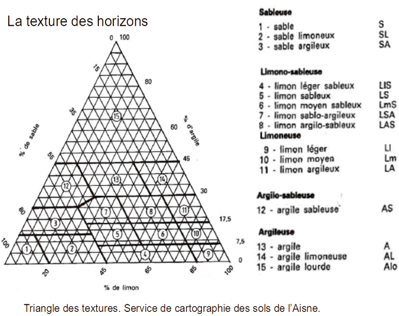

# INTRODUCTION

## DATA DESCRIPTION

Organisation of data files: there is separate sheet for each 4 pit data.
In each sheet, you have the same 16 variables:

3 variables serve for location of observation:

-   pit: the pit number, corresponding to the order in which it was dug

-   depth: depth in the pit, from 0cm to 100cm, by 20cm step

-   exposure: side of observation in the pit. There is two sides for
    each pit. The orientation of the side is indicated. Side's number
    correspond to the order of counting (S1 has been counted before S2)

Then for each combination value of (pit, side, depth), we have measured
and observed the next variables:

-   root1 ... root4: numeric, the amount of root for 4 diameter classes,
    counted in a square of 50cm long by 10cm deep, located at (pit,
    side, depth)

-   texture: factor, the texture of the horizon (see figure 1)

-   micas: ordered, the qualitative approximation of the amount of micas
    in the horizon, from 0 (no micas at all) to 3 (a lot of micas)

-   coarse_element: numeric, the percentage of stone content in the
    horizon

-   humidity: factor, dry or moist

-   structure_size: character, with first number corresponding to the
    size of small element, and second number corresponding to the size
    of big elements

-   density: ordered, dense firm or very dense

-   smudges: numeric, in percentage, estimated approximately by looking

-   colour1: factor, estimated with the Munsell color palette. Colour 1
    is the principal colour

-   colour2: factor, the second colour in proportion

{width="500"}

## GOALS OF THIS ANALYSIS

The goals of the code in this file is to study, in the ground of
tropical forest (P16 Paracou) the link between the root abundance and
soil texture, in particular the depth occurrence of silt horizon.

## Data pre-treatment

```{r}
library(readxl)
library(tidyverse)
library(ggplot2)
library(corrplot)
library(FactoMineR) # Pour l'analyse en composantes principales
library(factoextra) # Pour la représentation de l'ACP
setwd(dirname(rstudioapi::getActiveDocumentContext()$path))
```

```{r}
#--import data of each pit
dataPitF1 <- read_excel("FOSSE 1-4.xlsx", sheet=1, na="NA")
dataPitF2 <- read_excel("FOSSE 1-4.xlsx", sheet=2, na="NA")
dataPitF3 <- read_excel("FOSSE 1-4.xlsx", sheet=3, na="NA")
dataPitF4 <- read_excel("FOSSE 1-4.xlsx", sheet=4, na="NA")
dataPitF1$pit <- rep("F1", 100); dataPitF2$pit <- rep("F2", 100); dataPitF3$pit <- rep("F3", 100); dataPitF4$pit <- rep("F4", 100) #add a the variable pit to distinguish each sheet data before merging them

dataPit <- rbind(dataPitF1, dataPitF2, dataPitF3, dataPitF4)#merge them in one unique dataframe
remove(dataPitF1, dataPitF2, dataPitF3, dataPitF4) #remove separated sheets

#--convert depth code (P1 to P10) to their corresponding depth value (10 to 100cm)
dataPit$depth <- as.factor(dataPit$depth)
levels(dataPit$depth)  <- c("10", "100", "20", "30", "40", "50", "60", "70", "80", "90")
dataPit$depth <- as.numeric(as.character(dataPit$depth))

#--we split the side variable into two different one: sideOrient and sideNumber
dataPit$exposure <- as.factor(dataPit$exposure)
dataPit$exposure_orient <- substr(dataPit$exposure, 8, 20)#create side Orient and sideNumber
dataPit$exposure_number <- substr(dataPit$exposure, 6, 7)
dataPit <- dataPit[,!names(dataPit) =="exposure"]#remove side variable since it has been split

#--
dataPit$rd1 <- as.numeric(dataPit$rd1)
dataPit$rd2 <- as.numeric(dataPit$rd2)
dataPit$rd3 <- as.numeric(dataPit$rd3)
dataPit$rd4 <- as.numeric(dataPit$rd4)
dataPit$texture <- as.factor(dataPit$texture)
dataPit$micas <- as.factor(dataPit$micas)
dataPit$coarse_element <- as.numeric(dataPit$coarse_element) #WARNING, only 11 differents values
dataPit$water_reserve <- as.numeric(dataPit$water_reserve)
dataPit$humidity <- as.factor(dataPit$humidity)
dataPit$structure_type <- as.factor(dataPit$structure_type)
dataPit$structure_size <- as.character(dataPit$structure_size)
dataPit$density <- as.factor(dataPit$density)
dataPit$smudges <- as.numeric(dataPit$smudges) #WARNING, only 5 differents values
dataPit$colour1 <- as.factor(dataPit$colour1)
dataPit$colour2 <- as.factor(dataPit$colour2)
dataPit$pit <- as.factor(dataPit$pit)
dataPit$exposure_orient <- as.factor(dataPit$exposure_orient)
dataPit$exposure_number <- as.factor(dataPit$exposure_number)
```

### Coars element
During our field campaign, we tried to estimate the percentage of coarse
element in each horizon, but the estimation was not really accurate.
Then we decided to regroup coarse element data into three classes:
C\<0.1, 0.1\<C\<0.4, 0.4\<C. For each class we choose the mean of coarse
element as value, which will be used in the calculation of water
reserve. This new coarse element variable is considered as an
qualitative ordinal variable.

```{r}
dataPit$coarse_element_class <- dataPit$coarse_element #initialize variable
#first class
dataPit$coarse_element_class[dataPit$coarse_element>=0.4]<-mean(dataPit$coarse_element_class[dataPit$coarse_element>=0.4]) 
#second class
dataPit$coarse_element_class[between(dataPit$coarse_element,0.1,0.4)]<-mean(dataPit$coarse_element_class[dataPit$coarse_element<0.4])
#last class
dataPit$coarse_element_class[dataPit$coarse_element<=0.1]<-mean(dataPit$coarse_element_class[dataPit$coarse_element<=0.1])
dataPit$coarse_element_class <- round(dataPit$coarse_element_class, 2) #rounding to get clear value

dataPit$coarse_element_class <- as.ordered(dataPit$coarse_element_class) #setting as ordered
# summary(dataPit$coarse_element_class)
```

### Reorganization of data

#### By layer

```{r}
#--regroup data by layer of 10cm
dataPitLayer <- dataPit %>%
  # filter(pit=="F1") %>%
  select(c(pit, depth, texture, rd1, rd2, rd3, rd4, coarse_element_class)) %>%
  group_by(pit, depth) %>% 
  summarise(
    texture=unique(texture),
    coarse_element=mean(as.numeric(as.character(coarse_element_class))),
    rd1= mean(rd1),
    rd2=mean(rd2),
    rd3=mean(rd3),
    rd4=mean(rd4),
    root=mean(rd1+rd2+rd3+rd4))
ungroup(dataPitLayer)
```

#### By horizon

```{r}
dataPitHorizon <- dataPitLayer #initialize dataPitHorizon dataframe
dataPitHorizon <- dataPitHorizon %>% mutate(thickness=depth*0+10) #initialize thickness variable

d=1 #counter id
while(!is.na(dataPitHorizon$texture[d+1])){#while it remains layer to analyse
  up <- dataPitHorizon$texture[d]
  down <- dataPitHorizon$texture[d+1]
  if(up==down){#if the next layer has the same texture
    #agregate down layer with top layer
    dataPitHorizon$rd1[d] <- dataPitHorizon$rd1[d] + dataPitHorizon$rd1[d+1] 
    dataPitHorizon$rd2[d] <- dataPitHorizon$rd2[d]+ dataPitHorizon$rd2[d+1]
    dataPitHorizon$rd3[d] <- dataPitHorizon$rd3[d]+ dataPitHorizon$rd3[d+1] 
    dataPitHorizon$rd4[d] <- dataPitHorizon$rd4[d]+ dataPitHorizon$rd4[d+1] 
    dataPitHorizon$root[d] <- dataPitHorizon$root[d]+ dataPitHorizon$root[d+1]
    dataPitHorizon$coarse_element[d] <- dataPitHorizon$coarse_element[d] + dataPitHorizon$coarse_element[d+1]
    dataPitHorizon$thickness[d] <- dataPitHorizon$thickness[d]+10
    dataPitHorizon <- dataPitHorizon[-(d+1),] #remove down layer
    #don't change d: the down is coming up
  }
  else{d <- d+1} #going down
}

#meaning coars_element by thickness, which is equivalent to the number of layer
dataPitHorizon$coarse_element <- dataPitHorizon$coarse_element / (dataPitHorizon$thickness/10)
```


### Calculation of water reserve

$$
WR=\sum_{h} T_h\ R_h\ (1-C_h)
$$

with, for a ginven horizon $h$:

-   $R_h$ the usefull reserve (available in [Jamagne et al.,
    1977](https://appgeodb.nancy.inra.fr/biljou/fr/fiche/reserve-en-eau-du-sol)
    )
-   $C_h$ the percentage of coarse element (estimated on the field)
-   $T_h$ the thickness of the horizon

```{r}
R_value <- c(0.70, 1.00,	1.35,	1.20,	1.45,	1.60,	1.65,	1.75,	1.30,	1.75,	1.95,	1.70,	1.75,	1.80,	1.65) #values get from Jamagne et al. 1977
R_texture <- c("S",	"SL",	"SA",	"LIS"	,"LS",	"LmS",	"LSA",	"LAS",	"Ll",	"Lm",	"LA",	"AS",	"A",	"AL",	"Alo")#corresponding texture class for each R_value

dataPitHorizon <- dataPitHorizon %>% 
  mutate(WR=root*0)
RU <- R_value[which(dataPitHorizon$texture %in% R_texture)]
dataPitHorizon$WR <- dataPitHorizon$thickness * dataPitHorizon$coarse_element * setNames(R_value, R_texture)[dataPitHorizon$texture]
```

## Root biomass

For the calculation of root biomass, we weight each root count by the
diameter of the root class. The diameter classes are in millimeter: d1: $<2$, d2: $2-5$, d3: $5-10$ and d4: $≥ 10$.

# not directed analysis

```{r}
dataPit %>% # Dans donnees sols
  select_if(is.numeric) %>% # On ne sélectionne que les colonnes numériques
  cor() %>% # On calcule la matrice de corrélation empirique
  corrplot() # Puis on représente graphiquement cette matrice
```

```{r}
dataPitNorm <- dataPit %>% 
  select_if(is.numeric) %>% #On ne sélectionne que les colonnes numériques
  select(!stoneElement) %>%
  mutate_all(.funs = scale) # On applique à touts les colonnes la fonction scale
# La fonction scale centre et réduit un vecteur
# donnees_reduites # Toujours regarder ce qu'on a créé!

acpRes <- PCA(dataPitNorm, 
               scale.unit = TRUE, # Option pour centrer et réduire les données
               ncp = 18, # Nombre de composantes à conserver
               graph = FALSE)

acpRes

fviz_eig(acpRes, choice = "variance")

# Représentation dans le premier plan_principal
fviz_pca_var(acpRes,
             axes = c(1, 2)) # Numéro des axes à représenter 
fviz_pca_var(acpRes,
             axes = c(1, 3)) #
fviz_pca_var(acpRes,
             axes = c(2, 3)) # 
fviz_pca_var(acpRes,
             axes = c(1, 4))

corrplot(acpRes$var$cor)

# Représentation dans le premier plan_principal
fviz_pca_ind(acpRes,
             axes = c(1, 2)) # Numéro des axes à représenter 

# Représentation dans le premier plan_principal
fviz_pca_ind(acpRes,
             axes = c(1, 2), # Numéro des axes à représenter 
             col.ind = dataPit$texture) # Variable suppl. pour les individus

# Représentation dans le premier plan_principal
fviz_pca_ind(acpRes,
             axes = c(1, 2), # Numéro des axes à représenter 
             col.ind = dataPit$depth)
```

analyser l'évolution de l'écart au dessus / dedans de l'horizon
limoneux.

Projet ALT: à échelle Amazonienne: prévenir l'évolution des forêts
amazonienne en fonction changement climatique et antropiques. Basé sur
simulateur Troll (basé sur arbre adulte) & sur modélateur fait par
Vinciane sur l'impacte de l'exploitation forestière.

Problème de la considération des arbres "adultes" (DBH\>10cm). ==\> obj
est de prendre en compte les juvéniles

Thèse Vinciane Comprendre quels sont les besoins environnementaux des
arbres de sous-bois ==\> mesure de pleins de données environnementales
différentes (lumière humidité ect). Existence de niche écologique ?

Hypothèse de l'effet de la topographie sur la pédologie.

regarder s'il y a une correlation entre la presence des mica et les
limons.
