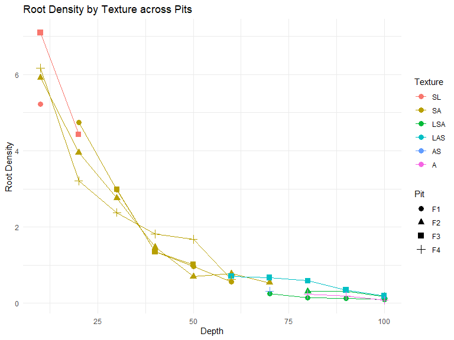

# INTRODUCTION

## DATA DESCRIPTION

Organisation of data files: there is separate sheet for each 4 pit data.
In each sheet, you have the same 16 variables:

3 variables serve for location of observation:

-   pit: the pit number, corresponding to the order in which it was dug

-   depth: depth in the pit, from 0cm to 100cm, by 20cm step

-   exposure: side of observation in the pit. There is two sides for
    each pit. The orientation of the side is indicated. Side's number
    correspond to the order of counting (S1 has been counted before S2)

Then for each combination value of (pit, side, depth), we have measured
and observed the next variables:

-   root1 ... root4: numeric, the amount of root for 4 diameter classes,
    counted in a square of 50cm long by 10cm deep, located at (pit,
    side, depth)

-   texture: factor, the texture of the horizon (see figure 1)

-   micas: ordered, the qualitative approximation of the amount of micas
    in the horizon, from 0 (no micas at all) to 3 (a lot of micas)

-   coarse_element: numeric, the percentage of stone content in the
    horizon

-   humidity: factor, dry or moist

-   structure_size: character, with first number corresponding to the
    size of small element, and second number corresponding to the size
    of big elements

-   density: ordered, dense firm or very dense

-   smudges: numeric, in percentage, estimated approximately by looking

-   colour1: factor, estimated with the Munsell color palette. Colour 1
    is the principal colour

-   colour2: factor, the second colour in proportion

{width="500"}

## GOALS OF THIS ANALYSIS

The goals of the code in this file is to study, in the ground of
tropical forest (P16 Paracou) the link between the root abundance and
soil texture, in particular the depth occurrence of silt horizon.

### Hypothesis

a.  Does particle size in soil, more specifically the presence of a silt
    horizon, pose a constraint to the growth of trees, considering both
    roots and above ground biomass?
    a.  Do roots react differently to soil texture, taking the diameter
        of the roots into account?
    b.  How does the depth of the silt horizon impact the concentration
        of the roots? a.3) Is the mica proportion in the soil correlated
        with the silt horizon occurrence?
    c.  Is above ground biomass (DBH, basal area, diversity, ...)
        influenced by the occurrence of a certain silt horizon?
    d.  Is there a difference between intermediate and big
        concentrations of silt in the effect? How does the silt effect
        vary with the silt concentration?
    e.  Is the relationship observed between root sand the silt horizon
        like the relationship between above ground biomass and the silt
        horizon?

## Data pre-treatment


```r
library(readxl)
library(tidyverse)
```

```
## ── Attaching core tidyverse packages ──────────────────────── tidyverse 2.0.0 ──
## ✔ dplyr     1.1.2     ✔ readr     2.1.4
## ✔ forcats   1.0.0     ✔ stringr   1.5.0
## ✔ ggplot2   3.4.2     ✔ tibble    3.2.1
## ✔ lubridate 1.9.2     ✔ tidyr     1.3.0
## ✔ purrr     1.0.1     
## ── Conflicts ────────────────────────────────────────── tidyverse_conflicts() ──
## ✖ dplyr::filter() masks stats::filter()
## ✖ dplyr::lag()    masks stats::lag()
## ℹ Use the conflicted package (<http://conflicted.r-lib.org/>) to force all conflicts to become errors
```

```r
library(ggplot2)
library(corrplot)
```

```
## corrplot 0.92 loaded
```

```r
library(FactoMineR) # Pour l'analyse en composantes principales
library(factoextra) # Pour la représentation de l'ACP
```

```
## Welcome! Want to learn more? See two factoextra-related books at https://goo.gl/ve3WBa
```

```r
require("rstudioapi")
```

```
## Le chargement a nécessité le package : rstudioapi
```

```r
setwd(dirname(rstudioapi::getActiveDocumentContext()$path))
```


```r
#--import data of each pit
dataPitF1 <- read_excel("FOSSE 1-4.xlsx", sheet=1, na="NA")
dataPitF2 <- read_excel("FOSSE 1-4.xlsx", sheet=2, na="NA")
dataPitF3 <- read_excel("FOSSE 1-4.xlsx", sheet=3, na="NA")
dataPitF4 <- read_excel("FOSSE 1-4.xlsx", sheet=4, na="NA")
dataPitF1$pit <- rep("F1", 100); dataPitF2$pit <- rep("F2", 100); dataPitF3$pit <- rep("F3", 100); dataPitF4$pit <- rep("F4", 100) #add a the variable pit to distinguish each sheet data before merging them

dataPit <- rbind(dataPitF1, dataPitF2, dataPitF3, dataPitF4)#merge them in one unique dataframe
remove(dataPitF1, dataPitF2, dataPitF3, dataPitF4) #remove separated sheets

#--convert depth code (P1 to P10) to their corresponding depth value (10 to 100cm)
dataPit$depth <- as.factor(dataPit$depth)
levels(dataPit$depth)  <- c("10", "100", "20", "30", "40", "50", "60", "70", "80", "90")
dataPit$depth <- as.numeric(as.character(dataPit$depth))

#--we split the side variable into two different one: sideOrient and sideNumber
dataPit$exposure <- as.factor(dataPit$exposure)
dataPit$exposure_orient <- substr(dataPit$exposure, 8, 20)#create side Orient and sideNumber
dataPit$exposure_number <- substr(dataPit$exposure, 6, 7)
dataPit <- dataPit[,!names(dataPit) =="exposure"]#remove side variable since it has been split

#--
dataPit$rd1 <- as.numeric(dataPit$rd1)
dataPit$rd2 <- as.numeric(dataPit$rd2)
dataPit$rd3 <- as.numeric(dataPit$rd3)
dataPit$rd4 <- as.numeric(dataPit$rd4)
dataPit$texture <- as.factor(dataPit$texture)
dataPit$texture <- factor(dataPit$texture, levels = rev(levels(dataPit$texture)))
dataPit$micas <- as.factor(dataPit$micas)
dataPit$coarse_element <- as.numeric(dataPit$coarse_element) #WARNING, only 11 differents values
dataPit$water_reserve <- as.numeric(dataPit$water_reserve)
dataPit$humidity <- as.factor(dataPit$humidity)
dataPit$structure_type <- as.factor(dataPit$structure_type)
dataPit$structure_size <- as.character(dataPit$structure_size)
dataPit$density <- as.factor(dataPit$density)
dataPit$smudges <- as.numeric(dataPit$smudges) #WARNING, only 5 differents values
dataPit$colour1 <- as.factor(dataPit$colour1)
dataPit$colour2 <- as.factor(dataPit$colour2)
dataPit$pit <- as.factor(dataPit$pit)
dataPit$exposure_orient <- as.factor(dataPit$exposure_orient)
dataPit$exposure_number <- as.factor(dataPit$exposure_number)
```

### Coars element

During our field campaign, we tried to estimate the percentage of coarse
element in each horizon, but the estimation was not really accurate.
Then we decided to regroup coarse element data into three classes:
C\<0.1, 0.1\<C\<0.4, 0.4\<C. For each class we choose the mean of coarse
element as value, which will be used in the calculation of water
reserve. This new coarse element variable is considered as an
qualitative ordinal variable.


```r
dataPit$coarse_element_class <- dataPit$coarse_element #initialize variable
#first class
dataPit$coarse_element_class[dataPit$coarse_element>=0.4]<-mean(dataPit$coarse_element_class[dataPit$coarse_element>=0.4]) 
#second class
dataPit$coarse_element_class[between(dataPit$coarse_element,0.1,0.4)]<-mean(dataPit$coarse_element_class[dataPit$coarse_element<0.4])
#last class
dataPit$coarse_element_class[dataPit$coarse_element<=0.1]<-mean(dataPit$coarse_element_class[dataPit$coarse_element<=0.1])
dataPit$coarse_element_class <- round(dataPit$coarse_element_class, 2) #rounding to get clear value

dataPit$coarse_element_class <- as.ordered(dataPit$coarse_element_class) #setting as ordered
# summary(dataPit$coarse_element_class)
```

### Reorganization of data

#### Regrouping textures by silt class

Soil texture classes are difficult to bring in order according to their silt content. Soil horizons put into the LSA class for example can have more silt content than LAS horizons, but it can also contain the same proportion in silt or more. Hence, we grouped them into three soil texture classes.

group A: high silt content: LSA, LAS
group B: intermediate silt content: SL, SA
group C: low silt content: AS, A


```r
silt_content <- c(LSA= "high", LAS= "high", SL= "intermediate", SA="intermediate", AS="low", A="low")
dataPit$siltcontent<-silt_content[substr(dataPit$texture, 1, 3)]
dataPit$siltcontent <- as.ordered(dataPit$siltcontent)
summary(dataPit$siltcontent)
```

```
##         high intermediate          low 
##          120          240           40
```

```r
#Auger$Silt_class <- ifelse(Auger$Texture_2023 %in% c("A", "Alo", "AS"), "low", ifelse(Auger$Texture_2023 %in% c("SL", "SA", "S"), "intermediate", "high"))
```


#### By layer

Each pit is made of 10 layers of 10cm depth by 50cm long.


```r
#--regroup data by layer of 10cm
dataPitLayer <- dataPit %>%
  # filter(pit=="F1") %>%
  select(c(pit, depth, texture, rd1, rd2, rd3, rd4, coarse_element_class, micas)) %>%
  group_by(pit, depth) %>% 
  summarise(
    texture=unique(texture),
    coarse_element=mean(as.numeric(as.character(coarse_element_class))),
    rd1= mean(rd1),
    rd2=mean(rd2),
    rd3=mean(rd3),
    rd4=mean(rd4),
    root=mean(rd1+rd2+rd3+rd4),
    micas=unique(micas))
```

```
## `summarise()` has grouped output by 'pit'. You can override using the `.groups`
## argument.
```

```r
ungroup(dataPitLayer)
```

```
## # A tibble: 40 × 10
##    pit   depth texture coarse_element   rd1   rd2   rd3   rd4  root micas
##    <fct> <dbl> <fct>            <dbl> <dbl> <dbl> <dbl> <dbl> <dbl> <fct>
##  1 F1       10 SL                0.05  40.7   1.3   0.8   0.5  43.3 0    
##  2 F1       20 SA                0.05  29.7   2.1   0.9   0.9  33.6 0    
##  3 F1       30 SA                0.14  24.9   1.2   0.3   0.1  26.5 0    
##  4 F1       40 SA                0.14  12.3   0.6   0     0    12.9 0    
##  5 F1       50 SA                0.05   9.3   0.2   0     0     9.5 2    
##  6 F1       60 SA                0.05   5.7   0     0     0     5.7 2    
##  7 F1       70 LSA               0.05   2.5   0     0     0     2.5 3    
##  8 F1       80 LSA               0.05   1.5   0     0     0     1.5 3    
##  9 F1       90 LSA               0.05   1.3   0     0     0     1.3 3    
## 10 F1      100 LSA               0.05   1     0     0     0     1   3    
## # ℹ 30 more rows
```

#### By horizon

We discriminate horizon according to the texture variable: one horizon
has one texture. One the field, the horizon were made according to the
color.


```r
dataPitHorizon <- dataPitLayer #initialize dataPitHorizon dataframe
dataPitHorizon <- dataPitHorizon %>% mutate(thickness=depth*0+10) #initialize thickness variable
dataPitHorizon$micas <- as.numeric(dataPitHorizon$micas) #swithhing to numeric juste for calculation in the loop
d=1 #counter id
while(!is.na(dataPitHorizon$texture[d+1])){#while it remains layer to analyse
  up <- dataPitHorizon$texture[d]
  down <- dataPitHorizon$texture[d+1]
  if(up==down){#if the next layer has the same texture
    #agregate down layer with top layer
    dataPitHorizon$rd1[d] <- dataPitHorizon$rd1[d] + dataPitHorizon$rd1[d+1] 
    dataPitHorizon$rd2[d] <- dataPitHorizon$rd2[d]+ dataPitHorizon$rd2[d+1]
    dataPitHorizon$rd3[d] <- dataPitHorizon$rd3[d]+ dataPitHorizon$rd3[d+1] 
    dataPitHorizon$rd4[d] <- dataPitHorizon$rd4[d]+ dataPitHorizon$rd4[d+1] 
    dataPitHorizon$root[d] <- dataPitHorizon$root[d]+ dataPitHorizon$root[d+1]
    dataPitHorizon$coarse_element[d] <- dataPitHorizon$coarse_element[d] + dataPitHorizon$coarse_element[d+1]
    dataPitHorizon$thickness[d] <- dataPitHorizon$thickness[d]+10
    dataPitHorizon$micas[d] <- dataPitHorizon$micas[d] + dataPitHorizon$micas[d+1]
    dataPitHorizon <- dataPitHorizon[-(d+1),] #remove down layer
    #don't change d: the down is coming up
  }
  else{d <- d+1} #going down
}

#meaning coars_element and micas by thickness/10, which is equivalent to the number of layers in one given horizon
dataPitHorizon$coarse_element <- dataPitHorizon$coarse_element / (dataPitHorizon$thickness/10)

dataPitHorizon$micas <- round(dataPitHorizon$micas / (dataPitHorizon$thickness/10))
dataPitHorizon$micas <- ifelse(dataPitHorizon$micas>3, 3, dataPitHorizon$micas)
dataPitHorizon$micas <- as.factor(dataPitHorizon$micas)


remove(d, down, up) #remove temporary variables
```

### Calculation of water reserve

$$
WR=\sum_{h} T_h\ R_h\ (1-C_h)
$$

with, for a ginven horizon $h$:

-   $R_h$ the usefull reserve (available in [Jamagne et al.,
    1977](https://appgeodb.nancy.inra.fr/biljou/fr/fiche/reserve-en-eau-du-sol)
    )
-   $C_h$ the percentage of coarse element (estimated on the field)
-   $T_h$ the thickness of the horizon


```r
R_value <- c(0.70, 1.00,	1.35,	1.20,	1.45,	1.60,	1.65,	1.75,	1.30,	1.75,	1.95,	1.70,	1.75,	1.80,	1.65) #values get from Jamagne et al. 1977
R_texture <- c("S",	"SL",	"SA",	"LIS"	,"LS",	"LmS",	"LSA",	"LAS",	"Ll",	"Lm",	"LA",	"AS",	"A",	"AL",	"Alo")#corresponding texture class for each R_value

dataPitHorizon <- dataPitHorizon %>% 
  mutate(WR=root*0)
RU <- R_value[which(dataPitHorizon$texture %in% R_texture)]
dataPitHorizon$WR <- dataPitHorizon$thickness * dataPitHorizon$coarse_element * setNames(R_value, R_texture)[dataPitHorizon$texture]
```

## Micas

```r
ggplot(dataPitHorizon, aes(x = pit, y = thickness, fill = texture, label = micas)) +
  geom_bar(stat = "identity") +  # Stacked bar plot
  geom_text(position = position_stack(vjust = 0.5), size = 3, color = "black") +  # Add text labels
  labs(x = "Pit", y = "Thickness", title = "Root Density by Texture across Pits") +
  scale_fill_discrete(name = "Texture") +  # Legend title for texture
  theme(legend.position = "right")  # Adjust legend position if needed
```

<!-- -->


## Root biomass

For the calculation of root biomass, we weight each root count by the
diameter of the root class. The diameter classes are in millimeter: d1:
$<2$, d2: $2-5$, d3: $5-10$ and d4: $≥ 10$.

The root density


```r
# root biomass by horizon
dataPitHorizon <- dataPitHorizon %>% mutate(rootDensity=round((rd1+rd2*2+rd3*5+rd4*10)/thickness, 2))

# root biomass by layer
dataPitLayer <- dataPitLayer %>% mutate(rootDensity=(rd1+rd2*2+rd3*5+rd4*10)/10)
```


```r
barplotHorizon <- ggplot(dataPitHorizon, 
                         aes(x = pit, 
                             y = thickness, 
                             fill = texture)
                             #label = rootDensity)
                         ) +
  geom_bar(stat = "identity") +  # Stacked bar plot
  #geom_text(position = position_stack(vjust = 0.5), size = 3, color = "black") +  # Add text labels
  labs(x = "Pit", y = "Thickness", title = "Root Density by Texture across Pits") +
  scale_fill_discrete(name = "Texture") +  # Legend title for texture
  theme(legend.position = "right")  # Adjust legend position if needed
# 
# barplotHorizon + geom_rect(data = NULL, aes(xmin = 1.5, xmax = 3.5, ymin = 28, ymax = 52),
#             fill = "transparent", color = "black", size = 1, inherit.aes = FALSE) +
# geom_text(data = data.frame(x = 2.5, y = 40, label = "Highlighted", stringsAsFactors = FALSE),
#             aes(x, y, label = label), color = "blue", size = 4)
```

```r
# Your existing plot code without rootDensity label
your_plot <- ggplot(dataPitHorizon, aes(x = pit, y = thickness, fill = texture)) +
  geom_bar(stat = "identity") +
  geom_text(position = position_stack(vjust = 0.5), size = 3, color = "black") +
  labs(x = "Pit", y = "Thickness", title = "Root Density by Texture across Pits") +
  scale_fill_discrete(name = "Texture") +
  theme(legend.position = "right")

# # Add an empty rectangle with colored border and text label
# highlighted_plot <- your_plot +
#   geom_rect(data = NULL, aes(xmin = 2, xmax = 3, ymin = 100, ymax = 150),
#             fill = "transparent", color = "blue", size = 1, inherit.aes = FALSE) +
#   geom_text(data = data.frame(x = 2.5, y = 125, label = "Highlighted", stringsAsFactors = FALSE),
#             aes(x, y, label = label), color = "blue", size = 4)
# 
# highlighted_plot
```


```r
y_limits <- with(dataPitHorizon, range(rootDensity))
ggplot(dataPitHorizon, aes(x = texture, y = rootDensity)) +
  geom_point() +  # Use points to represent the data
  facet_wrap(~ pit, scales = "free") +  # Separate by 'pit'
  labs(x = "Texture", y = "Root Density", title = "Root Density across Pits and Textures") +
  ylim(y_limits)  # Setting constant y-axis scale
```

<!-- -->

```r
# Plotting all pits in a facet grid
ggplot(dataPitLayer, aes(x = depth, y = rootDensity, color = texture, group = texture)) +
  geom_line() +
  geom_point() +
  labs(x = "Depth", y = "Root Density", title = "Root Density by Texture across Pits") +
  scale_color_discrete(name = "Texture") +
  facet_wrap(~ pit, ncol = 2) +  # Facet by pit, adjust ncol as needed
  theme_minimal()
```

<!-- -->

```r
# Plotting all pits in a single graph
ggplot(dataPitLayer, aes(x = depth, y = rootDensity, color = texture, group = interaction(pit, texture))) +
  geom_line() +
  geom_point() +
  labs(x = "Depth", y = "Root Density", title = "Root Density by Texture across Pits") +
  scale_color_discrete(name = "Texture") +
  facet_grid(. ~ pit, scales = "free_y", space = "free_y") +
  theme_minimal()
```

<!-- -->

```r
# Plotting all pits in a single graph with inverted axes
ggplot(dataPitLayer, aes(x = rootDensity, y = depth, color = texture, group = interaction(pit, texture))) +
  geom_line() +
  geom_point() +
  labs(x = "Root Density", y = "Depth", title = "Root Density by Texture across Pits") +
  scale_color_discrete(name = "Texture") +
  facet_grid(pit ~ ., scales = "free_x", space = "free_x") +
  coord_flip() +
  theme_minimal()
```

<!-- -->

```r
# Selecting a specific pit (change 'Pit_1' to the desired pit ID)
selected_pit <- c("F1", "F2","F3", "F4")
data_subset <- subset(dataPitLayer, pit %in% selected_pit)
data_subset <- subset(data_subset, between(depth, 0, 100))
ggplot(data_subset, aes(x = depth, y = rootDensity, color = texture, shape = pit, group = interaction(pit, texture))) +
  geom_line() +
  geom_point(size = 3) +
  labs(x = "Depth", y = "Root Density", title = "Root Density by Texture across Pits") +
  scale_color_discrete(name = "Texture") +
  scale_shape_discrete(name = "Pit") +
  theme_minimal()
```

<!-- -->
- Add square on top of the plot, to hilight the intervall between F2 and F3, with the rootdensity difference calculated.
- Look at the difference between SL and SA for small roots.


### Distinction of root diameter

```r
library(ggplot2)
library(tidyr)

# Selecting a specific pit
selected_pit <- c("F1", "F2", "F3", "F4")
data_subset <- subset(dataPitLayer, pit %in% selected_pit)
data_subset <- subset(data_subset, depth >= 50)

# Reshaping the data to long format to include all diameter classes into one column
data_subset_long <- gather(data_subset, diameter_class, value, rd1:rd4)

ggplot(data_subset_long, aes(x = depth, y = value, color = texture, linetype = pit, group = interaction(pit, texture))) +
  geom_line() +
  geom_point(size = 3) +
  labs(x = "Depth", y = "Diameter Classes", title = "Diameter Classes by Texture across Pits") +
  scale_color_discrete(name = "Texture") +
  scale_linetype_discrete(name = "Pit") +
  facet_wrap(~diameter_class, scales = "free_y", ncol = 1) +
  theme_minimal()
```

<!-- -->


# not directed analysis


```r
dataPit %>% # Dans donnees sols
  select_if(is.numeric) %>% # On ne sélectionne que les colonnes numériques
  cor() %>% # On calcule la matrice de corrélation empirique
  corrplot() # Puis on représente graphiquement cette matrice
```

<!-- -->


analyser l'évolution de l'écart au dessus / dedans de l'horizon
limoneux.

Projet ALT: à échelle Amazonienne: prévenir l'évolution des forêts
amazonienne en fonction changement climatique et antropiques. Basé sur
simulateur Troll (basé sur arbre adulte) & sur modélateur fait par
Vinciane sur l'impacte de l'exploitation forestière.

Problème de la considération des arbres "adultes" (DBH\>10cm). ==\> obj
est de prendre en compte les juvéniles

Thèse Vinciane Comprendre quels sont les besoins environnementaux des
arbres de sous-bois ==\> mesure de pleins de données environnementales
différentes (lumière humidité ect). Existence de niche écologique ?

Hypothèse de l'effet de la topographie sur la pédologie.

regarder s'il y a une correlation entre la presence des mica et les
limons.
