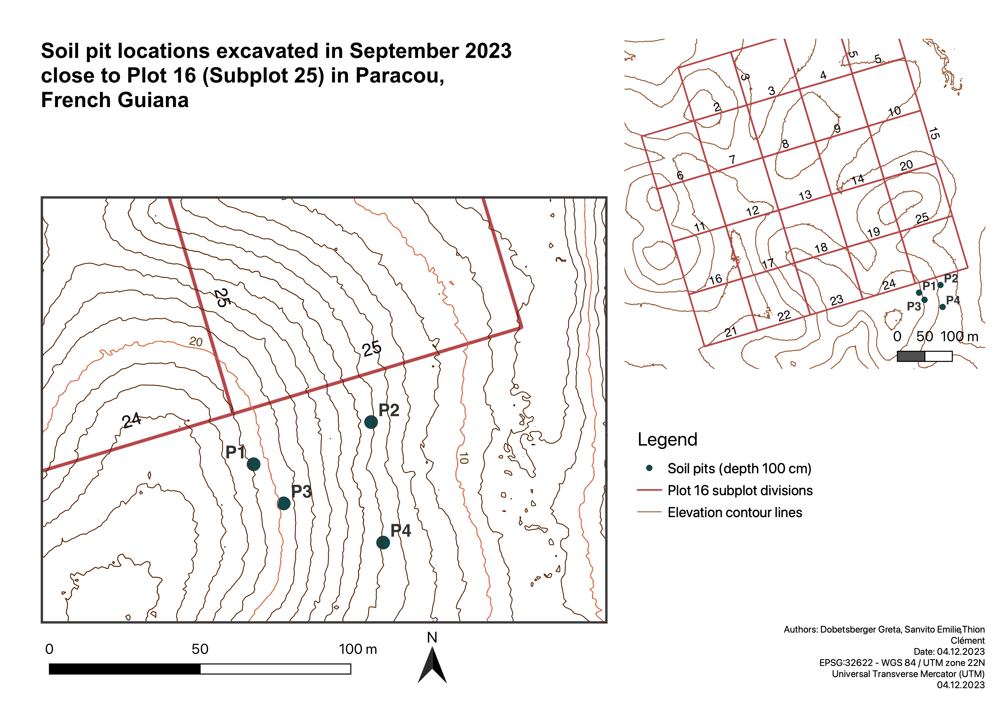
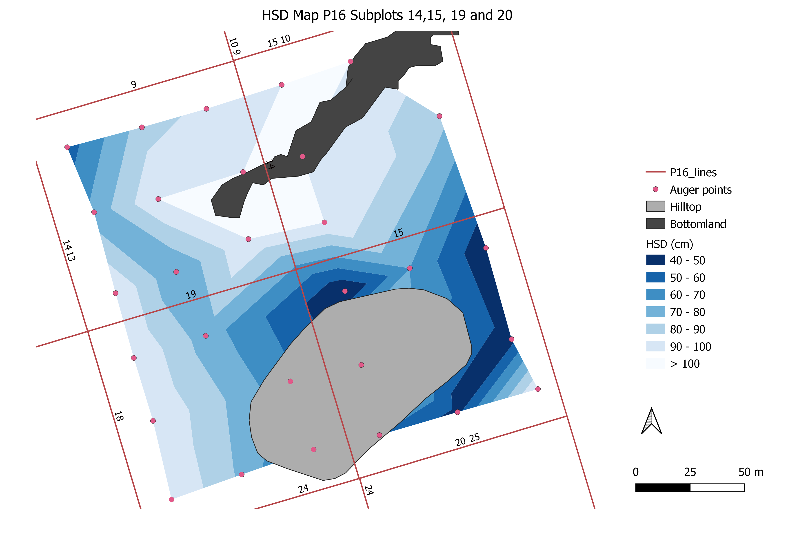
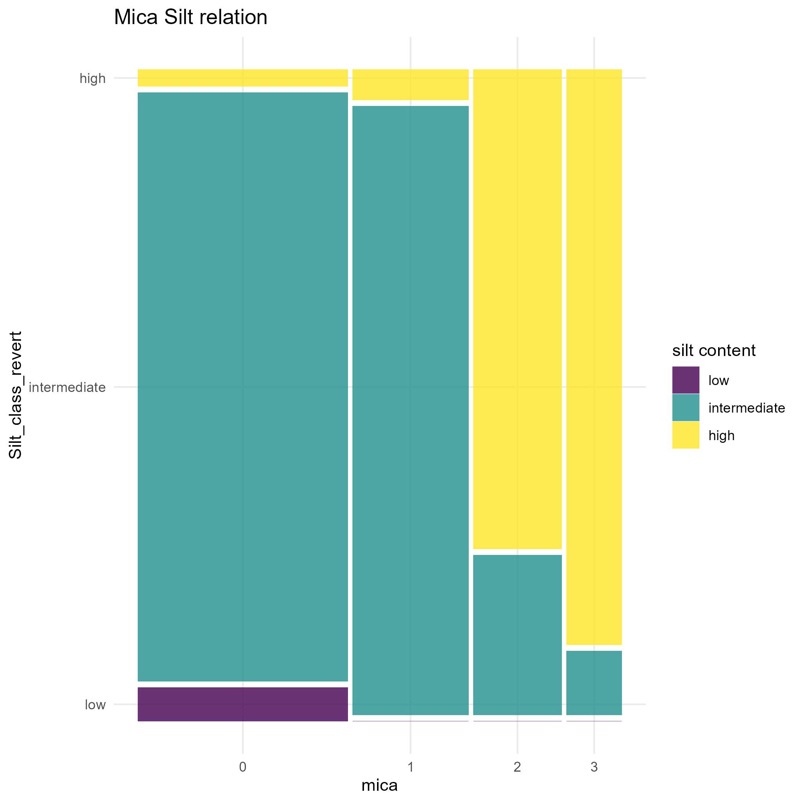

```{r DoNotModify, include=FALSE}
### Utilities. Do not modify.
# Installation of packages if necessary
InstallPackages <- function(Packages) {
  InstallPackage <- function(Package) {
    if (!Package %in% installed.packages()[, 1]) {
      install.packages(Package, repos="https://cran.rstudio.com/")
    }
  }
  invisible(sapply(Packages, InstallPackage))
}

# Basic packages
InstallPackages(c("bookdown", "formatR", "kableExtra", "ragg"))

# kableExtra must be loaded 
if (knitr::opts_knit$get("rmarkdown.pandoc.to") == "docx") {
  # Word output (https://stackoverflow.com/questions/35144130/in-knitr-how-can-i-test-for-if-the-output-will-be-pdf-or-word)
  # Do not use autoformat (https://github.com/haozhu233/kableExtra/issues/308)
  options(kableExtra.auto_format = FALSE)
}
library("kableExtra")

# Chunk font size hook: allows size='small' or any valid Latex font size in chunk options
def.chunk.hook  <- knitr::knit_hooks$get("chunk")
knitr::knit_hooks$set(chunk = function(x, options) {
  x <- def.chunk.hook(x, options)
  ifelse(options$size != "normalsize", paste0("\n \\", options$size,"\n\n", x, "\n\n \\normalsize"), x)
})
```

```{r Options, include=FALSE}
### Customized options for this document
# Add necessary packages here
Packages <- c("tidyverse")
# Install them
InstallPackages(Packages)

# knitr options
knitr::opts_chunk$set(
  cache =   FALSE,    # Cache chunk results
  include = TRUE,     # Show/Hide chunks
  echo =    TRUE,     # Show/Hide code
  warning = FALSE,    # Show/Hide warnings
  message = FALSE,    # Show/Hide messages
  # Figure alignment and size
  fig.align = 'center', out.width = '80%',
  # Graphic devices (ragg_png is better than standard png)
  dev = c("ragg_png", "pdf"),
  # Code chunk format
  tidy = TRUE, tidy.opts = list(blank=FALSE, width.cutoff=50),
  size = "scriptsize", knitr.graphics.auto_pdf = TRUE
  )
options(width = 50)

# ggplot style
library("tidyverse")
theme_set(theme_bw())
theme_update(panel.background=element_rect(fill="transparent", colour=NA),
             plot.background=element_rect(fill="transparent", colour=NA))
knitr::opts_chunk$set(dev.args=list(bg="transparent"))

# Random seed
set.seed(973)
```


# Introduction

In tropical ecology, the relationship between root distribution and soil abiotic factors is crucial to forest community structure [@bardgettGoingUndergroundRoot2014]. Roots are essential for the nutrition and water uptake of trees [@hutchingsUNDERSTANDINGCONSEQUENCESSOIL2003; @hodgeRootDecisions2009]. Their distribution is driven by factors like soil texture, nutrient content, topography, and water content [@freschetStartingGuideRoot2021]. 

A large part of the forests in French Guiana features a topography alternating between hills and valleys [@ferryGeneseFonctionnementHydrique2003]. Acrisol [@iussworkinggroupwrbWorldReferenceBase2022], characterised by superficial lateral drainage (SLD), is the typical soil type on slopes [@fanHydrologicRegulationPlant2017]. Acrisol is characterised by a silty texture horizon with low permeability that functions as a drainage barrier in the soil [@ferryGeneseFonctionnementHydrique2003; @humbelCaracterisationParMesures1978]. 

Drainage type, and to a lesser extent topography, are the main factors influencing forest community structure [@pelissierWithinplotRelationshipsTree2002; @sabatierInfluenceSoilCover1997]. Root vertical distribution (RVD) is the distribution of roots in units of biomass over sequential soil layers [@freschetStartingGuideRoot2021]. In soil with superficial lateral drainage, root development is inhibited by the drainage barrier [@ferryGeneseFonctionnementHydrique2003].   

Tree roots are therefore concentrated in the uppermost layers of the soil [@humbelCaracterisationParMesures1978], characterised by low water reserves. Consequently, roots in this soil type may undergo drought stress during the dry season.  During the rainy season, this impermeable silty horizon will cause a temporary water table in the soil [@humbelCaracterisationParMesures1978; @pelissierWithinplotRelationshipsTree2002], which creates anoxic stress for tree roots [@sabatierInfluenceSoilCover1997]. 

Our study takes place at Paracou research station in French Guiana. @epronSpatialVariationSoil2006 confirmed the presence of SLD in this area. They found that the depth of the drainage barrier on slopes depends on the topographical position, with deeper barriers at higher elevation. However, the specific ways in which drainage barriers influence both roots and forest structure remain understudied. Therefore, we examined whether a drainage barrier restricts tree roots on slopes in Paracou, exploring their role in shaping forest  community structure. We investigated the effect of the depth, at which the drainage barrier occurs, on root vertical distribution and on 3 different forest structure indicators (DBH, species richness and tree density). Our main hypotheses are: (1) root density not only decreases with depth, but is also negatively influenced by the drainage barrier; (2) the depth at which the drainage barrier appears can be a predictor of DBH, species richness and tree density.  


# Material and method

## Study site

The study took place at Paracou research station in French Guiana (5°18’N; 52°53’W), a 40000 ha domain owned by CNES (National Centre for Space Studies) containing 16 permanent plots studied by the French research centre CIRAD for over 35 years. Elevation ranges from 5 to 50 m, and the mean annual temperature is 26 °C, with an annual range of 1–1.5 °C. Rainfall averages 2980 mm per year with a 3-month dry season (< 100 mm month) from mid-August to mid-November. The landscape is characterised by a patchwork of low hills (100–300 m wide and 20–35 m high) separated by narrow streams. The soil type in this area is mostly Acrisol [@iussworkinggroupwrbWorldReferenceBase2022] and soil depth is restricted by a poorly draining, loamy saprolite, typically encountered at a depth of around 1 m [@epronSpatialVariationSoil2006]. Sampling was carried out as part of the ALT-project (Amazonian Landscapes in Transition 2022-2025). 


## Pit data collection

Pit excavation allows the collection of root distribution data [@freschetStartingGuideRoot2021]. Four pits were sampled between September 11 and 16, 2023, just outside of plot 16 (P16), next to the subplots 24-25 (Fig. 1), to avoid disturbances on inventoried trees.

(ref:Pitlocations2) Study site and Pit locations at Paracou research station. P1-4 represent pit 1-4.

<aside>
```{r Pitlocations2, fig.cap="(ref:Pitlocations2)", echo=FALSE, out.width='90%'}

```
</aside>

We implemented a standardised experimental design, ensuring uniform topographical conditions for the soil pits. All pits were excavated at a mid-slope position with a consistent inclination of 17-18%, characterised by superficial lateral drainage. Potential pits were prospected using an auger in order to dig pits with maximum HSD variability. Based on [@epronSpatialVariationSoil2006] we expected the HSD to be between 60 cm and 80 cm deep. Rectangular pits, 100 cm deep and 50 cm wide, were dug with pickaxes and spades.

After cleaning the exposed soil surface in the pits by scraping, colour and texture changes were used to identify horizons (Appendix Fig. 8) on one side of the pit [@ferryGeneseFonctionnementHydrique2003]. For each horizon, the depth was measured, mica content was visually estimated from 0 (mica absence) to 3 (high mica content), and soil samples were moistened to estimate the texture by touch [@jahnGuidelinesSoilDescription2006]. We used the @jamagneSoilMappingVital1977 soil texture triangle. For two sides of the pit, we counted the roots using a 100 x 50 cm grid subdivided in squares of 10 x 10 cm [@freschetStartingGuideRoot2021], to characterise RVD. In each square, roots were counted and classified by diameter (< 2 mm, 2-5 mm, 5-10 mm and ≥ 10 mm). 

## Auger and botanical data

In addition to our pit data, we used 36 auger samples collected during a 2022 data collection campaign on the P16 of Paracou, in the subplots 14, 15, 19 and 20 (Appendix Fig. 4). The auger samples were positioned with a spacing of 33 meters between each sampling point. In contrast to the pit data collection, root abundance was not sampled. For the complete auger collection method, we refer to @dognypietteAbioticFactorsRelated.
The botanical data corresponds to the 2020 inventory of the GUYAFOR tree database, which monitors trees of Diameter at Breast Height (DBH) superior to 10 cm. In our study area, this data was completed with data from the ALT project, which also included trees of DBH > 1 cm. 


## Data analysis

### Pit data analysis

We regrouped the soil textures into a categorial variable “silt content”, identified using the texture triangle [@jamagneSoilMappingVital1977]: low (A, Alo, AS), intermediate (SL, SA, S), and high (LSA, LAS, LS). We defined the depth (cm) at which the silt content changed to high for each pit, which we refer to as “high silt depth” (HSD). HSD is used to determine the depth of the drainage barrier, which is characterised by a silty texture [@ferryGeneseFonctionnementHydrique2003; @humbelCaracterisationParMesures1978]. Given the small sample size (4 pits), we chose to only conduct visual analysis of HSD effect on RVD. As roots were counted per layer of 10 cm, and soil texture was determined per soil horizon, we assigned a texture class to every 10 cm layer of the soil. 

In order to approximate root biomass, a root index was calculated by weighing each root count with its corresponding minimum diameter class and summing the totality weighted count. Using the minimum diameter leads to an underestimation of the total root biomass, although it remains valuable for pit comparison.
$RI_d = \sum_{i=1}^4 r_i n_i$, with $d$ layer depth (cm), $i$ index of the diameter class (< 2 mm, 2-5 mm, 5-10 mm and ≥ 10 mm), $r_i \in [1, 2, 5, 10]$ minimum root diameter, $n_i$ count of root in diameter class $i$. The minimum root diameter of the first class (<2 mm) is set to 1 mm as we assume it is the smallest diameter detectable by bare eye.

We then assessed the relation between root index and silt content. Root index was compared between pits 2 and 3 at the depth of 50-70 cm. This depth range is where maximum HSD variation between two pits occurs. Fixing the depth accounts for the effect that root index decreases exponentially with depth. We calculated the decrease of root index in the selected depth range (total root index at 50-70 cm divided by total root index at 0-50 cm) for pits 2 and 3 and compared them.


### Auger and botanical data analysis

Out of the 36 auger measurements available, we focused our analysis on the subset of 29 measurements that contained texture class data. The auger points were located using the coordinates of the closest inventoried tree on the plot. As for the pit data, soil textures in the pits were grouped into “high”, “intermediate”, and “low” silt content, and HSD was defined for each auger point following the same methodology as employed for the pit data. We defined the depth (cm) at which the silt content changed to high for each auger sample, which we refer to as “high silt depth” (HSD). HSD is used to indicate the depth of the drainage barrier, characterised by a silty texture [@ferryGeneseFonctionnementHydrique2003; @humbelCaracterisationParMesures1978]. For auger points without any horizons high in silt, we defined HSD to be 100 cm, which is the maximum depth of the auger measurements. As topography, besides drainage type, strongly influences forest community structure [@baldeckSoilResourcesTopography2013; @ferryHigherTreefallRates2010] and can be correlated with soil texture and drainage [@epronSpatialVariationSoil2006], we did a correlation test (Spearman method due to non-normality of HSD) between elevation (m) and HSD (cm). 

We mapped the area where auger samples were taken and created contour lines based on the values of HSD of the different auger points (Appendix Fig. 4). The contour lines were created with the Contour Plugin in QGIS. We employed 10 cm contour line intervals, resulting in the formation of seven distinct HSD classes, from 40 cm to 100 cm deep. With this approach, we interpolated HSD values spatially across nearly the entire 4 ha study area. Every tree on the map could therefore be linked to a certain HSD class and the corresponding coverage area ($m^2$) of each HSD class was also determined. 

Only slopes were considered during further analysis. Topographical data comes from [@dourdainGISDATADICTIONARY2022], which defines slope as the zone with a slope > 25 % and the absence of a permanent water table, no deeper than 1 m in the middle of the dry season. For each HSD class species richness was extracted from the botanical data by counting the number of species present in the area. The total number of trees was extracted by counting the number of trees present in the area.  Due to the ordinal nature of the different HSD classes, they cannot be considered as a categorical variable. Hence, we assigned a specific intermediate HSD value to each HSD class. For example, an HSD class from 40 cm to 50 cm was designated the value of 45 cm. This creates a continuous HSD-value, allowing us to perform a Poisson regression for both species richness and number of trees (HSD continuous values as predictor, species richness or number of trees as response). The areas covered by a specific HSD class varied between 1015 $m^2$ (HSD 40-50 cm) and 5494 $m^2$ (HSD 90-100 cm), with the total area considered being 21055 $m^2$. To take into account that some HSD classes cover a larger area  than others, offset is set to logarithm of area per HSD class in the model. This way the number of trees and species richness per area are modelled. The relationship between DBH (cm) and HSD (cm) did not show linear dependency (Fig. 3c), making it difficult to construct a precise model.

Muscovite (white mica) degrades into kaolinite [@nicoliniEvidenceWeatheringStages2009] with a particle size classified as silts. Thus, to complement our detection of the drainage barrier, we try to use mica content as a complementary indicator of silt content.  A chi-squared test was done to quantitatively assess the association between silt content (categorical variable) and mica content (categorical variable) in the different horizons of the auger data. Cramer’s V was calculated to indicate the strength and direction of the association.  We tried to replace silt content by mica content for the pit data analysis, and verified whether the results were similar.

All analyses were performed in R (version 4.2.2) (R Core Team (2022). R: A language and environment for statistical computing. R Foundation for Statistical Computing, Vienna, Austria. URL https://www.R-project.org/) and QGIS (version 3.28 Firenze).


# Results
```{r include=FALSE}
load(file = "pedoP16_data-PIT.rda") #load data for pit analysis
load(file = "pedoP16_data-AUGER.rda") #load data for auger analysis
library(cowplot) #to plot several ggplot on a single frame
library(ggplot2) #for theme function
```


```{r include=FALSE}
#create a function to ajuste plot labels when using cowplot
adjust_plot <- function(plot, title_size = 6, legend_size = 4) {
  plot +
    theme(
      plot.title = element_text(size = 12),
      legend.text = element_text(size = 6),
      legend.title = element_text(size = 6),
      axis.title = element_text(size = 9),
      axis.text = element_text(size = 5),
      legend.spacing = unit(4, units = "mm"),
      legend.key.size = unit(2,units = "mm")
    )
}
```
## Pit data

HSD ranges across the pits, spanning from 50 cm to 70 cm (Fig. 2a). In contrast to our expectations, the four pits show similar root index variations with depth, regardless the variation in silt content. Fig. 2b shows a general decrease of root index   with depth, from 60 roots at a depth of 10 cm to 10 roots at 50 cm. Focussing on the specific depth range of 50-70 cm, it becomes evident that the root index of P3 (pit 3) does not exceed that of P2 (pit 2), even though P3 shows high silt content and P2 intermediate silt content. The ratio of root index in the focus range (50-70 cm) (Fig. 2a) and root index in the depth range above (0-50 cm) between P2 and P3 also showed no difference (0.137 for P2 and 0.142 for P3).

(ref:pit) a) Silt content (low, intermediate, high) and b) root index, calculated by weighing each root count with its corresponding maximum diameter class, per layer of 10 cm across pits excavated in September 2023. P1-4 correspond to pits 1-4.

```{r pit, echo=FALSE, fig.cap="(ref:pit)", fig.env="figure*", out.extra=""}
plot_grid(
  adjust_plot(pitPlot_SiltcontentProfile),
  adjust_plot(pitPlot_rootIndexSilt), 
  nrow = 1, ncol = 2
)
```

## Mica as an indicator for silt

The chi-squared test assessing the association between silt and mica content in the auger samples was highly significant (chi-square = 57.154, p-value < 0.001). Cramer’s V, assessing the strength and direction of the association, was 0.58, supporting a strong positive relationship. The association is depicted in a mosaic plot in Appendix Fig. 5, illustrating an increase of silt content with rising mica content. By replacing mica content with silt content in the pit data analysis where the relation between root index and silt content are assessed, we found a similar result (Appendix Fig. 7).

## Auger data

A significant but small decrease (p-value = 0.00245; Estimate = -0.0044) in species richness with HSD class was detected. Among all HSD classes, the range of 40 to 50 cm stands out with notably higher species richness per ha (Fig. 3a). This range contains the uppermost observed HSD. Species richness per ha is lowest for the 90 cm to 100 cm HSD range. For HSD class “No high silt” species richness was higher than for the HSD classes 70-100 cm.   Tree density significantly decreases   with HSD class (p-value < 2e-16; Estimate = -0.013 ), although Fig. 3b shows that the tree density first increases between HSD 40 cm to 70 cm. Tree density increases a little when the HSD is not detected, the lowest tree density being present at HSD 90 cm to 100 cm range. 

Fig. 3c and 3d illustrate the relationship between the DBH and HSD classes. The mean DBH values and quantiles are very similar over all classes (mean = 4.9 cm), primarily due to the high representation of trees with small diameter (minimum diameter count > 1 cm). A pattern is visible in the maximum values of the outliers, representing trees with a DBH > 50 cm, which increases with HSD class.


(ref:auger) Forest structure indicators relation with HSD (high silt depth) class (cm). a) Species richness (per ha) in function of HSD classes, b) Tree density (per ha) in function of HSD classes, c) DBH (diameter at breast height in cm) in function of HSD classes, d) DBH filtered (max value = 50 cm) in function of HSD classes 

```{r auger, echo=FALSE, fig.cap="(ref:auger)", fig.env="figure*", out.extra=""}
plot_grid(
  adjust_plot(augerPlot_richness), 
  adjust_plot(augerPlot_density),
  adjust_plot(augerPlot_DBH), 
  adjust_plot(augerPlot_DBH_50),
  nrow = 2, ncol = 2
)
```

A significant negative correlation was found between elevation (m) and HSD (cm) (rho = -0.634; p-value = 0.0002246). A higher position along the topographical gradient therefore indicates lower HSD.


# Discussion

## Root distribution with HSD and depth

Our findings on RVD align with the literature, illustrating that most roots are present within the first 30 cm of the soil [@freschetStartingGuideRoot2021; @schenkGlobalBiogeographyRoots2002]. HSD ranges across the pits, spanning from 50 cm to 70 cm (Fig. 2a), coincides with the depth range (60-80 cm) of the drainage barrier identified by @epronSpatialVariationSoil2006. This strengthens our choice to use of HSD as an estimator of the drainage barrier depth.  

We expected that the drainage barrier restricts roots, and therefore to find less roots below the HSD, as was observed by @humbelCaracterisationParMesures1978. However, there is no visually discernible effect of HSD on vertical root distribution (Fig. 2b), no matter the root diameter (Appendix Fig. 6). The absence of an HSD effect might be because roots of certain species can penetrate the drainage barrier, which suggests a deeper water uptake and therefore higher drought resistance [@ferryGeneseFonctionnementHydrique2003]. The absence of an observed effect may also be due to the small HSD variation between the sampled pits (maximum variation of 20 cm). Additionally, the small sample size of 4 pits precluded the performance of a statistical test. More soil pits would be needed to study root distribution in additional soil profiles. 


## Mica-silt correlation

Our findings indicate a strong association between silt and mica content. Given that mica is shiny and easily detectable, identifying HSD by high mica content instead of high silt content might simplify and expedite the data collection process. This approach may offer a more efficient means of assessing drainage barrier depth in Paracou.

## Forest structure indicators with HSD  

Species richness decreases when HSD increases (Fig. 3a). @sabatierInfluenceSoilCover1997 found higher species richness on soils with a thinner permeable soil layer. This indicates a higher species richness on SLD, which present on slopes. @alliePervasiveLocalScaleTreeSoil2015 confirmed that the species richness is the highest on mid-slope. As HSD is negatively correlated with topography, an increase in HSD indicates a decrease in elevation (more downslope), and therefore explains the decrease in species richness. The decrease in drought stress with increasing HSD might also explain this declining trend in species richness [@sabatierInfluenceSoilCover1997]. The estimate (-0.0044) indicates that the detected significant decrease is relatively small. It is likely that a difference in HSD of 60 cm has a minor effect on species richness.

Tree density varies with DBH, with lower tree density in areas with high DBH. Since the mean DBH remains consistent across the different HSD classes (Fig. 3c), we can compare our tree densities between the different HSD classes. We found that tree density is higher when the drainage barrier is closer to the surface. This result contradicts @sabatierInfluenceSoilCover1997 who found no effect of drainage type, and therefore SLD, on tree density. This contradiction may result from the small minimum diameter count used in our botanical data (>1 cm) compared with @sabatierInfluenceSoilCover1997 who considered only trees with DBH >10 cm. Trees of small diameter which might benefit from the presence of a drainage barrier, as it retains water closer to the surface, making it more accessible for their roots. If the drainage barrier is too high, this might increase stress for small tree roots during the rainy season (anoxic stress), explaining the highest densities at intermediate drainage barrier depth (HSD) (Fig 3b). Moreover, the varying species composition across different HSD classes and their adaptability to soil constraints and water availability may contribute to the observed differences in tree density between different HSD classes.

While the mean DBH remains consistent across the different HSD classes, a pattern can be observed in the outliners (Fig. 3c). Trees of DBH >50 cm increase in DBH with increasing HSD class (Fig. 3d). This result suggests that the drainage barrier affects trees throughout their lifespan and becomes only visible in trees with higher diameter. Therefore, deeper HSD contributes to higher diameter growth when the drainage barrier is deeper in the soil. 

We observed a robust negative correlation (rho = -0.634) in our data between elevation and HSD .  As elevation increases, the depth of the restricting layer decreases. This finding contradicts @epronSpatialVariationSoil2006 discovery of deeper drainage barriers at higher elevations. The difference in results can be attributed to the differences in the elevation range considered. @epronSpatialVariationSoil2006 solely focused on the depth of drainage barriers on slopes, whereas our correlation test encompassed hilltops and bottomlands. In our study, the maximum elevation difference between two auger points was 12 m, going from 8 m to 20 m. Fewer auger points were situated on hilltops (Appendix Fig. 4) which skews our data towards an elevation range predominantly covering a topographic gradient from slopes to bottomlands. Knowing that SLD is typically present on slopes [@fanHydrologicRegulationPlant2017; @pelissierWithinplotRelationshipsTree2002], the impermeable silty texture horizon likely disappears towards the bottomlands [@bouletAnalyseStructuraleCartographie1982], which  accounts for the observed decrease in HSD with elevation. The correlation between topography and drainage type makes it difficult to distinguish the drainage barrier effect on community structure from other effects associated with topography, like nutrient content [@pegueroNutrientbasedSpeciesSelection2023; @vanlangenhoveNaarEenBeter2020]. 

Caution is necessary when interpreting these results. Firstly, we chose to use only seven classes to keep significant HSD variation, thus with only one value per class the tests rely on seven values only. Secondly, HSD was spatially extrapolated over 4 ha based on auger measurements distanced 33 m  from each other. Diverse soil textures and soil profiles can be found within a short geographical distance, which was also observed with our pits. Microtopography is known to influence forest structure [@schwartzTopographyTraitsModulate2020]. To improve our study design, an autocorrelation test for short distance HSD measurements could have been valuable to determine the maximum extrapolation distance of HSD. This would allow a more precise connection between botanical data and HSD values.    

With our study, we showed that tree-soil interactions are highly relevant and influence tree community structure. By exploring the connections between superficial lateral drainage on slopes, forest structure indicators and root density, we provide insights on how the depth of a drainage barrier might affect forest communities in French Guiana. For pits sampled next to the P16 in Paracou 2023, no effect of drainage barrier on root vertical distribution has been found. Species richness decreases and maximum DBH increases when the drainage barrier occurs deeper in the soil, complementing earlier findings regarding drainage type effects. For smaller diameters, no difference in DBH for the different HSD classes was observed. Tree density was higher for intermediate HSD classes (50-70 cm), allowing young trees to profit from superficial water tables. Sample size for this study was small, especially for the soil pits, and analyses were possible only to a limited extent. Despite these limitations, this study provides lead information on drainage barriers and their effect in Paracou. Further studies on a larger scale are needed to gain a clearer picture of how soil structural constraints affect roots and forest structure in Amazonia.


# Acknowledgements

We are grateful to our supervisors Vincyane Badouard and Pierre-André Wagner for their support and patience. Further we want to thank our colleagues from the FTH module 2023 and the EFT Master 2022, who provided preliminary work and data. We thank Timothy Chubb for support with scientific writing and language. We are also grateful to Lucia Clarotto, Stéphane Traissac, Camille Salmon and Mélaine Aubry-Kientz for the fruitful discussions on general context of this study and suggestions of determinant methodological choices.


# Appendix

(ref:HSDMapwithBFandPL) HSD contour line map of subplots 14, 15, 19 and 20 of the P16.

<aside>
```{r HSDMapwithBFandPL, fig.cap="(ref:HSDMapwithBFandPL)", echo=FALSE, out.width='60%'}

```
</aside>

(ref:augerPlotmicaCor) Mosaic plot displaying the relationship between mica and silt content. Dark grey represents high silt content, grey represents moderate silt content, and light grey signifies low silt content. Mica content ranges from 0 to 3, denoting low (0) to high (3) levels.

<aside>
```{r augerPlotmicaCor, fig.cap="(ref:augerPlotmicaCor)", echo=FALSE, out.width='60%'}

```
</aside>

(ref:pitPlotdiameterClassDistinct) Root quantity for all diameter classes for all pits. rd1, rd2, rd3, rd4 correspond respectively with diameter classes of < 2 mm, 2-5 mm, 5-10 mm and ≥ 10 mm. For silt content, hight is LSA or LAS, intermediate is SL or SA, and low is AS or A.

```{r pitPlotdiameterClassDistinct, echo=FALSE, fig.cap="(ref:pitPlotdiameterClassDistinct)"}
plot(pitPlot_diameterClassDistinct)
```

(ref:pitPlotrootIndexMicas) Root index across soil depths in different pits, considering varying levels of mica content ranging from low (0) to high (3). 

```{r pitPlotrootIndexMicas, echo=FALSE, fig.cap="(ref:pitPlotrootIndexMicas)"}
plot(pitPlot_rootIndexMicas)
```


(ref:pitPlotTextureProfile) Soil texture profiles of the four pits.

```{r pitPlotTextureProfile, echo=FALSE, fig.cap="(ref:pitPlotTextureProfile)"}
plot(pitPlot_TextureProfile)
```


